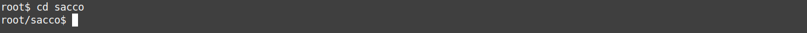
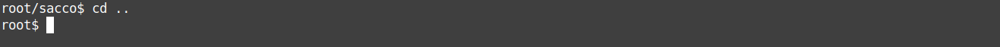

# SO_FAT
Progetto per Sistemi Operativi 2023/2024. 
L'utente può "formattare" un file come un file system e crearvi file e cartelle, salvare ed esportare dati.
La trashbash permette di esplorare il file system emulando una cli.

## Compilazione ed esecuzione
Per eseguire compilazione e linking del programma è sufficiente eseguire il comando (nella cartella del progetto):
make
Per avviare il programma (test rapido e poi avvio della trashbash):
./so_fat_exec

## Testing
L'interfaccia che simula una shell è sufficiente per provare le funzionalità e contiene le informazioni sui comandi disponibili.

Per rimuovere i messaggi di debug, commentare 
#define DEBUG 
nel file common.h e ricompilare.

## Esempio
Monto il file system di esempio presente nel file fat.myfat:

Creo una nuova cartella di nome "sacco":

Mi sposto nella cartella:

Vi copio un file:

Torno alla cartella root e stampo la rappresentazione ad albero del file system:

